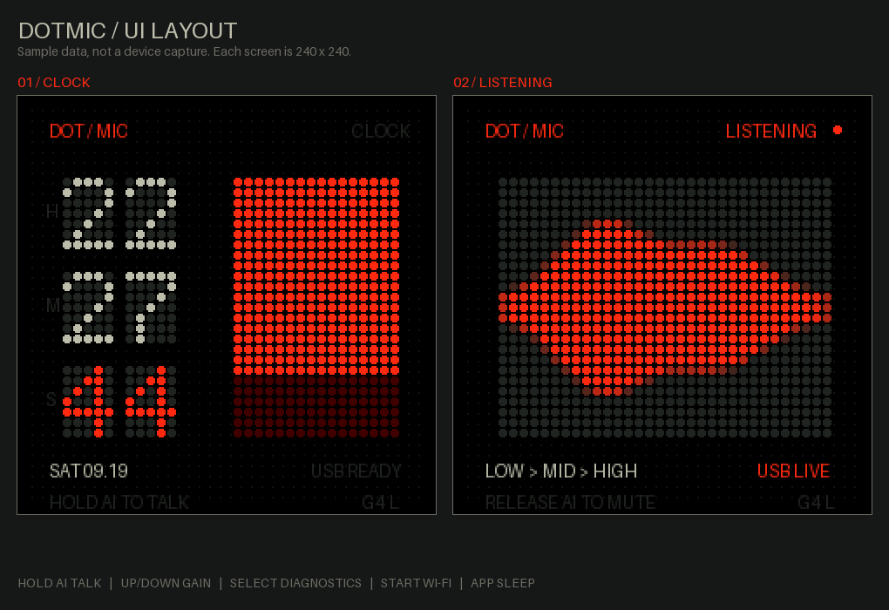
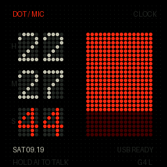
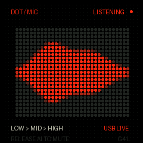
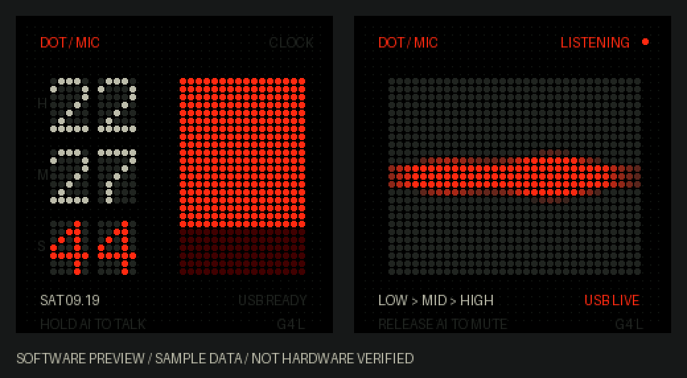

# DotMic

[中文](README.zh-CN.md)



A push-to-talk USB microphone and dot-matrix clock for the S3AI Game
(ESP32-S3) handheld. Hold the AI key, talk, release to mute. The screen shows
a real FFT spectrum while you speak and an NTP-backed clock when you don't.

The device enumerates as a standard USB audio input, so any recorder or
dictation tool on the host picks it up. The firmware only provides audio;
speech-to-text happens on the computer.

## Screens

| | |
|---|---|
|  |  |
| Clock | Listening |



Previews are rendered by `preview.py` from the firmware's own glyph table, with
sample data. They are a layout check, not a device capture.

## Keys

| Action | Key |
|---|---|
| Hold to talk, release to mute | AI / GPIO0 |
| Light sleep / wake | APP / GPIO10 |
| Microphone gain, 1–16, default 4 | Up / Down |
| Diagnostics on / off | SELECT |
| Diagnostics page (STATUS / DEVICE) | Left / Right |
| Wi-Fi provisioning on / off | START |

Auto-sleep after 10 s idle, suspended while recording, while the host is
streaming, and while the diagnostics page is open.

## Install

The image is **application-only**. Install it with the Launcher SD file
browser; do not write it to flash offset `0x0`, and do not install the merged
image or partition table from `.pio`.

1. Copy `dist/DotMic-v1.8.bin` anywhere on the TF card.
2. Pick it in the Launcher file browser.
3. Connect the host with a data-capable USB cable. On launch, USB switches from
   Serial/JTAG to audio + CDC, so the COM port number may change.
4. Select `S3AI DotMic` as the recording input. Some drivers show it as
   `TinyUSB UAC1`.
5. Hold AI and talk.

USB is UAC1, mono, 48 kHz, 16-bit, with a CDC serial port for logs. The
ESP32-S3 has BLE only and no classic Bluetooth HFP, so it cannot pair as an
ordinary Bluetooth headset microphone.

If USB stops responding, hold AI/BOOT and press reset to enter ROM download
mode. Do not hold AI during a normal boot.

## Clock

Time comes from Wi-Fi plus NTP. Press START, join the `samestick` hotspot from
a phone, and enter your network. The device syncs against `ntp.aliyun.com`,
`time.cloudflare.com` and `pool.ntp.org`, and displays Beijing time.

The clock keeps running once the host is disconnected, and the RTC keeps
running through light sleep. After a full power cycle the time is unknown and
the screen shows `--` and `START: WIFI`.

## Spectrum

The display is a real FFT, not an animation driven by volume:

- 48 kHz PCM, 1024-point Hann window, 46.875 Hz resolution, ~21.3 ms per frame
- 24 analysis bands on a roughly logarithmic split, covering about 94 Hz–12 kHz
- Interpolated to 32 display columns; the extra columns are smoothing, not
  added frequency resolution
- Fixed −66 to −6 dBFS height mapping, no automatic gain, so a quiet room stays
  quiet on screen
- 60 ms attack, 180 ms release, five-point weighted smoothing
- Low band orange, mid and high grey-white

Smoothing affects the display only. The audio sent to the host is untouched.
This shows energy per band; it is not a pitch or note detector, and one sound
usually lights several bands through its harmonics.

`USB IDLE` means the host has not opened the stream. `USB LIVE` means it has.
When AI is not held the USB connection stays up but submits zero samples.
Nothing is recorded or uploaded on the device.

## Hardware

| | |
|---|---|
| MCU | ESP32-S3, 16 MB flash, 8 MB PSRAM |
| Display | 240x240 ST7789, SPI mode 0, 40 MHz, X-mirrored, BGR subpixel |
| Microphone | MSM261S I2S, BCLK 4, WS 5, DIN 6 |
| Display pins | MOSI 46, SCLK 11, DC 12, CS 3, RST 7, backlight 9 |
| TF card | 1-bit SDMMC, CLK 40, CMD 39, D0 41 |
| USB | native GPIO19/20, VID `303A`, PID `D07C` |

The microphone runs 48 kHz dual-slot 32-bit. It starts on the left slot and
compares RMS between slots to pick whichever one is live, takes the top 16
bits, removes DC and clips. The active slot shows on the clock screen as `AL`
or `AR`, and the diagnostics page reports `rmsL` / `rmsR` directly.

The USB serial number is derived from the MAC (`DOTMIC-...`) so Windows does
not reuse a stale audio instance.

TF card is checked on every boot with a unique `/dotmic-check-xxxxxxxx.tmp`:
write, read back, compare, delete. A failure is reported, never formatted.

## Build

```bash
pio run -e s3ai-dotmic
python package.py
```

`pio run` only produces `.pio/build/s3ai-dotmic/firmware.bin`. `package.py`
verifies the image and partition bounds and writes `dist/`. The firmware and
`package.py` must report the same version or packaging aborts.

Dependencies resolve from the PlatformIO registry, and the board definition is
vendored under `boards/` (see [boards/NOTICE.md](boards/NOTICE.md)), so a clean
clone builds without any other checkout.

On Windows, enable long paths before the first build or the toolchain fails to
unpack:

```powershell
New-ItemProperty -Path "HKLM:\SYSTEM\CurrentControlSet\Control\FileSystem" `
  -Name LongPathsEnabled -Value 1 -PropertyType DWORD -Force
```

Regenerate the screen previews (after one `pio run`, which fetches the font):

```bash
python preview.py
```

The spectrum mapping has a host-side test that compiles the same
`src/spectrum.h` the firmware uses:

```bash
zig c++ -std=c++17 -O2 tools/test_spectrum.cpp -o test_spectrum
./test_spectrum
```

It covers the 234.4 / 1875 / 9375 Hz band mapping, two-tone mixing, silence, DC
removal, 6 dB amplitude steps, the noise gate, display range, continuity across
frame intervals and decay to silence. These are algorithm tests. They say
nothing about recording quality, USB timing or on-device performance.

## Status

Built, packaged and checksummed; see `dist/manifest.json` and
`SHA256SUMS.txt`. Audio quality, display, wake behaviour and sleep current have
not been measured on hardware. Treat the numbers above as design intent rather
than verified results.

## Related

- [wifi-portal](https://github.com/sameclub/wifi-portal) — the shared provisioning library
- [PipBoy](https://github.com/sameclub/pipboy) — Fallout-style system monitor for the same device
- [VoxStick](https://github.com/sameclub/voxstick) — desk terminal for local coding agents

## Licence

MIT. See [LICENSE](LICENSE).
